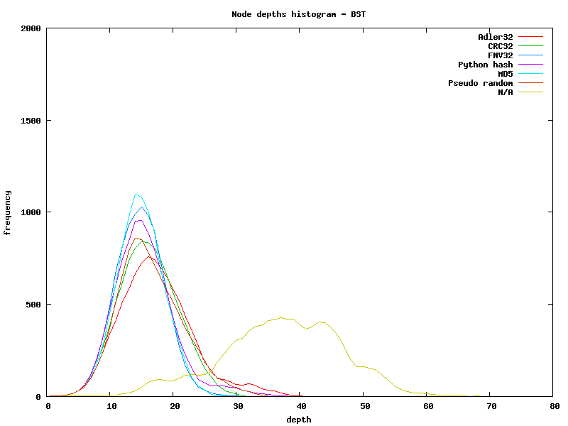
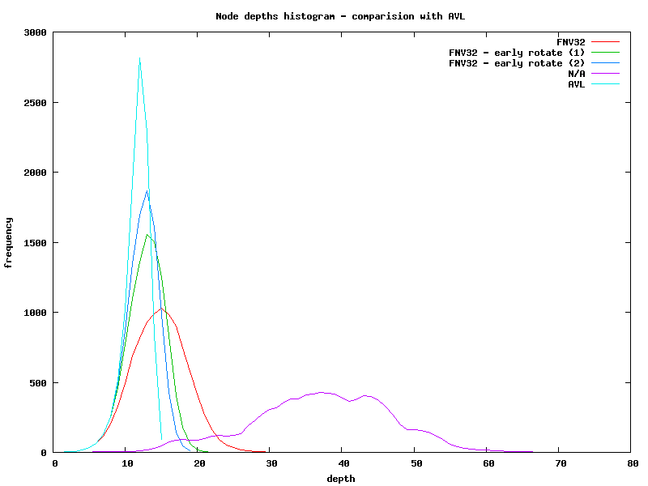
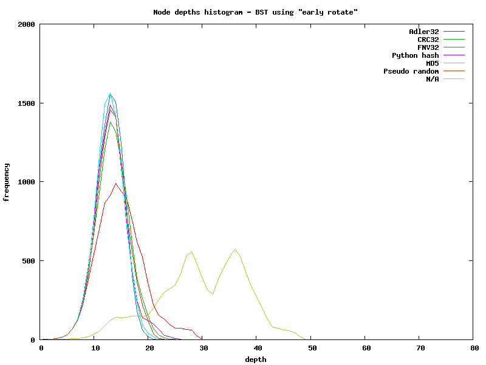
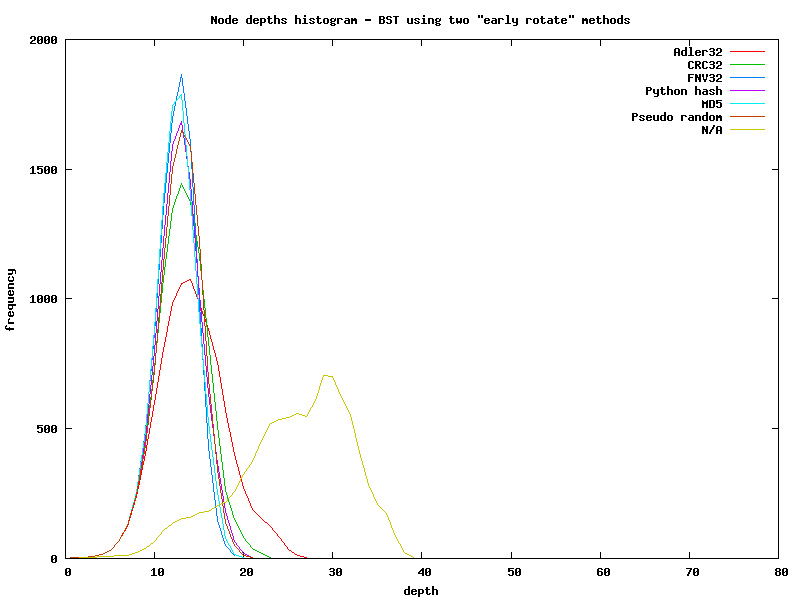

========================================================================
                       Random binary trees
========================================================================

.. contents::

Introduction
------------------------------------------------------------------------

Binary trees are sensitive to insertion order, in worst case (inserting
sorted values) tree becomes a list. AVL and Red-Black trees overcome
this at cost of more complicated inserting/removing and additional storage.

However, instead of using AVL/RB it's possible to avoid degenerated
case. The idea is to use as key not value, but hashed value, which is
almost random.

But tree shape is far from near-optimal AVL.

Early rotate
~~~~~~~~~~~~~~~~~~~~~~~~~~~~~~~~~~~~~~~~~~~~~~~~~~~~~~~~~~~~~~~~~~~~~~~~

Improvement by "early rotating" --- when newly inserted node would
create a 3-element linear subtree, like::

	. node 1
	.  \
	.   node 2
	.    \
	.     new node

then standard rotation is done on subtree rooted at ``node 1``.

The pros of this method: constant time and memory, and --- the most
important --- decrease tree depth.

Early rotate (2)
~~~~~~~~~~~~~~~~~~~~~~~~~~~~~~~~~~~~~~~~~~~~~~~~~~~~~~~~~~~~~~~~~~~~~~~~

Improvement by "early rotating (2)" --- when newly inserted node would
create a long, tight subtree (B, D, F could be null, and als)::

	.   A
	.  / \
	. B   C
	.    / \
	.   D   E
	.      / \
	.     F   new node

then whole subtree is perfectly balanced. Detecting such situation
is more difficult, but also helps.

Experiments
------------------------------------------------------------------------

Input is all paths form ``/usr``::

	$ find /usr > list
	$ wc -l list
	101374 list

Degenerated case --- inserting sorted data
~~~~~~~~~~~~~~~~~~~~~~~~~~~~~~~~~~~~~~~~~~~~~~~~~~~~~~~~~~~~~~~~~~~~~~~~

::

	$ python main.py -f ~/list -k value -l 100 -s
	loading data
	... trimming to 100 entries
	... sorting
	inserting data using function value...
	getting stats...
	statistics

	   nodes count: 100
	  values count: 100
	    collisions: 0
	     avg depth: 49.50
	     max depth: 99
	AVL max height: 9.28
	R-b max height: 13.32

When hash is used::

	$ python main.py -f ~/list -k hash -l 100 -s
	loading data
	... trimming to 100 entries
	... sorting
	inserting data using function hash...
	getting stats...
	statistics

	   nodes count: 100
	  values count: 100
	    collisions: 0
	     avg depth: 6.10
	     max depth: 11
	AVL max height: 9.28
	R-b max height: 13.32

Key is a value
~~~~~~~~~~~~~~~~~~~~~~~~~~~~~~~~~~~~~~~~~~~~~~~~~~~~~~~~~~~~~~~~~~~~~~~~

::

	$ python main.py -f ~/list -k none
	loading data
	inserting data using function none...
	getting stats...
	statistics

	   nodes count: 101374
	  values count: 101374
	    collisions: 0
	     avg depth: 68.47
	     max depth: 187
	AVL max height: 23.62
	R-b max height: 33.26

Key is a hash value
~~~~~~~~~~~~~~~~~~~~~~~~~~~~~~~~~~~~~~~~~~~~~~~~~~~~~~~~~~~~~~~~~~~~~~~~

Hash is value calculated by python interpreter.
There are **collisions**.

::

	$ python main.py -f ~/list -k hash
	loading data
	inserting data using function hash...
	getting stats...
	statistics

	   nodes count: 101373
	  values count: 101374
	    collisions: 2
	     avg depth: 20.13
	     max depth: 47
	AVL max height: 23.62
	R-b max height: 33.26

Key is a pseudorandom seeded by value
~~~~~~~~~~~~~~~~~~~~~~~~~~~~~~~~~~~~~~~~~~~~~~~~~~~~~~~~~~~~~~~~~~~~~~~~

Again **collisions**.

::

	$ python main.py -f ~/list -k random
	loading data
	inserting data using function random...
	getting stats...
	statistics

	   nodes count: 101371
	  values count: 101374
	    collisions: 6
	     avg depth: 21.06
	     max depth: 43
	AVL max height: 23.62
	R-b max height: 33.26

Comparision
~~~~~~~~~~~~~~~~~~~~~~~~~~~~~~~~~~~~~~~~~~~~~~~~~~~~~~~~~~~~~~~~~~~~~~~~

Theoretical max heights:

* AVL: 18.78
* R-b: 26.54

+---------------+---------------+-----------+-----------+
| tree          | key function  | avg depth | max depth |
+===============+===============+===========+===========+
|               | N/A           | 37.13     | 71        |
|               +---------------+-----------+-----------+
|               | Adler32       | 17.45     | 41        |
|               +---------------+-----------+-----------+
|               | CRC32         | 16.15     | 32        |
|               +---------------+-----------+-----------+
|               | FNV32         | **14.82** | 31        |
|    BST        +---------------+-----------+-----------+
|               | Python hash   | 15.56     | 38        |
|               +---------------+-----------+-----------+
|               | MD5           | 14.89     | **29**    |
|               +---------------+-----------+-----------+
|               | random        | 16.49     | 35        |
+---------------+---------------+-----------+-----------+
|               | N/A           | 29.73     | 49        |
|               +---------------+-----------+-----------+
|               | Adler32       | 14.89     | 30        |
|               +---------------+-----------+-----------+
|               | CRC32         | 13.46     | 25        |
|               +---------------+-----------+-----------+
|               | FNV32         | **12.88** | **22**    |
|   BST         +---------------+-----------+-----------+
|   with        | Python hash   | 13.19     | 26        |
|   early       +---------------+-----------+-----------+
|   rotate      | MD5           | **12.88** | 26        |
|               +---------------+-----------+-----------+
|               | random        | 13.29     | 23        |
+---------------+---------------+-----------+-----------+
|               | N/A           | 25.48     | 39        |
|               +---------------+-----------+-----------+
|               | Adler32       | 14.27     | 27        |
|               +---------------+-----------+-----------+
|               | CRC32         | 13.11     | 23        |
|               +---------------+-----------+-----------+
|               | FNV32         | **12.37** | **19**    |
|   BST         +---------------+-----------+-----------+
|   with        | Python hash   | 12.70     | 21        |
|   early       +---------------+-----------+-----------+
|   rotate      | MD5           | 12.42     | 20        |
|   (1) & (2)   +---------------+-----------+-----------+
|               | random        | 12.79     | 21        |
+---------------+---------------+-----------+-----------+
| **AVL**       |               | 11.62     | 15        |
+---------------+---------------+-----------+-----------+
